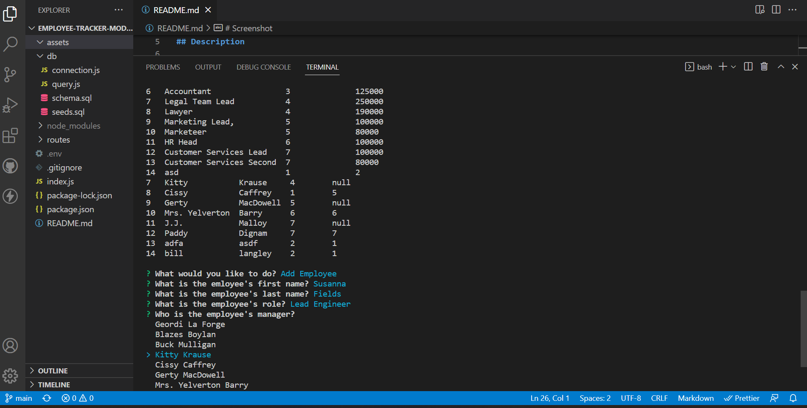

# Employee-Tracker

[Employee Tracker](https://kalebritt.github.io/employee-tracker/)

## Description

With this handy app, the user can track employee's information. This includes department, salary, manager, and more. The user can also add new employees and change department information elegantly displayed in tables in the terminal. Click on the link below to see a video of the app in action!

[See the app!](https://watch.screencastify.com/v/sVxdLGN90J3IroOLLFoo)

## Table of Contents

- [Employee-Tracker](#employee-tracker)
  - [Description](#description)
  - [Table of Contents](#table-of-contents)
- [Usage](#usage)
- [Screenshot](#screenshot)
- [Credits](#credits)
- [License](#license)
- [Installation](#installation)

# Usage

This Command-Line Interface (CLI) utilizes an Application Programming Interface (API) using Express.js and MYSQL database using Sequalize.

# Screenshot

Below is a screenshot of the deployed app.

# Credits

Tremendous credit to Jude C. and her infinite knowledge and experience she was generous enough to share with me.

# License

# Installation

'npm i' is a good place to start!
